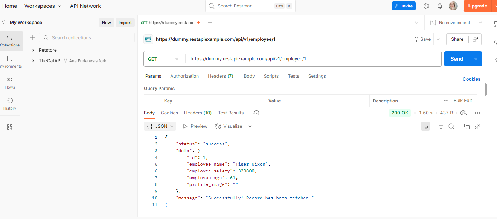
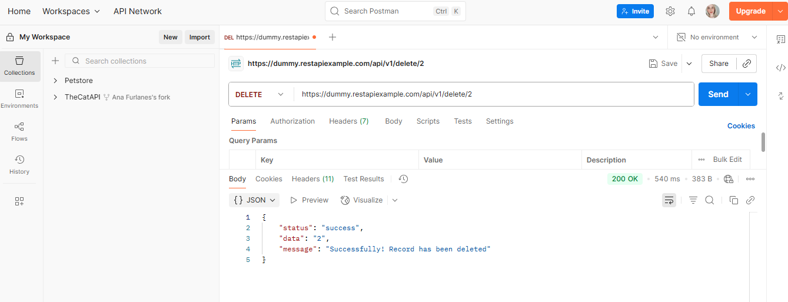

# Quick Start Guide for Beginners

This guide will walk you through how to use Postman to interact with the employee API, even if you've never used an API before.

## 1. Fetching Employee Data

To fetch the information of an employee with ID "1":

1.  Open your API client (Postman).
2.  Create a new request and select the **GET** method.
3.  In the URL field, type: `https://dummy.restapiexample.com/api/v1/employee/1`
4.  Click the **"Send"** button.

The response will appear below. If the status is `200 OK`, the request was successful!

---

## 2. Deleting an Employee

To delete an employee with ID "2":

1.  Create a new request in your API client.
2.  Select the **DELETE** method.
3.  In the URL field, type: `https://dummy.restapiexample.com/api/v1/delete/2`
4.  Click the **"Send"** button.

The response should return a `200 OK` status and a success message, confirming that the employee has been removed.
